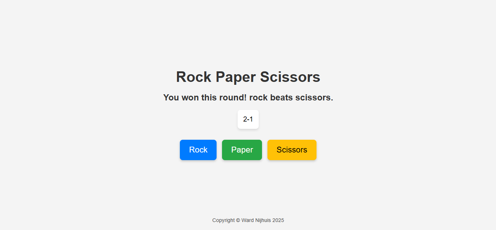
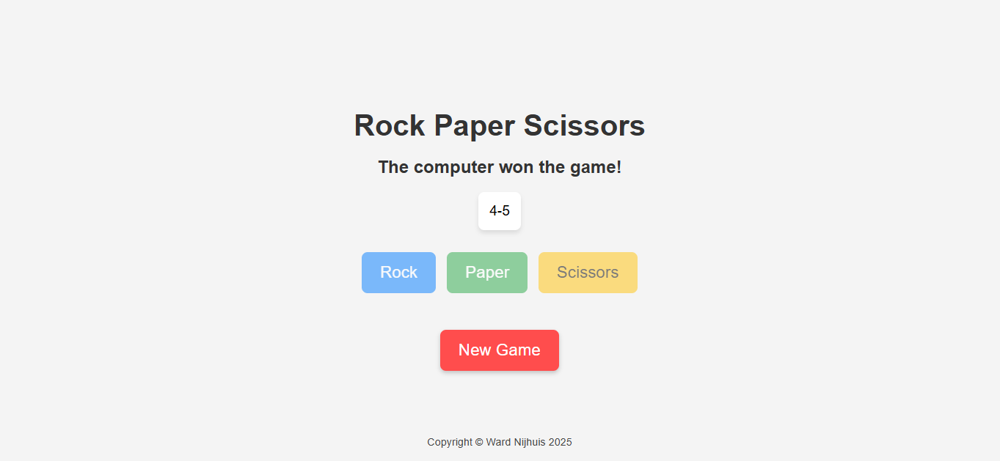

# Rock Paper Scissors

## Description

This project features a simple rock-paper-scissors game that can be played against the computer until either the player or the computer gets to 5 points. Wins are worth one point, ties give no points. After each round the winner and score are displayed and after the game ends a reset button appears to start a new game.

The website is build using vanilla HTML, CSS and JavaScript. Flexbox is used for the layout of the elements on the page and event listeners are used to handle the interactivity of the page.

As I started by writing a console based game, it was quite tricky to turn this into a web based game. It was a really good project to give me an overview of the basic DOM-manipulation methods and JavaScript concepts. I also needed to do some research into random number generation (rng) and transforms for additional styling.

In the future I would like to add support for a two player mode, maybe even between players on different devices. I would also like to add additional weapons, including lizard and sponck.

## Usage

You can visit the website [here](https://wardnijhuis.github.io/rock_paper_scissors/). The user can start a game by clicking one of the three buttons and after the game they can use the reset button to start another game.

## License

[MIT](https://github.com/wardnijhuis/rock_paper_scissors/blob/main/LICENSE)
